# A low-light video enhancement system  

### **W251-Summer 2020: Final Project**  
### *Team: [Lina Gurevich](mailto:lgurevich@berkeley.edu), [William Casey King](mailto:caseyking@berkeley.edu), [Neha Kumar](mailto:neha.kumar@berkeley.edu), [Sony Wicaksono](mailto:aji.wicaksono@berkeley.edu)*

## Introduction and Project Motivation  

Images and videos captured in low-light conditions suffer from low contrast, poor visibility, and noise contamination. Those issues challenge both human visual perception that prefers high-contrast images, and numerous intelligent systems relying on computer vision algorithms.  

Concretely, analyzing security camera footage that was recorded during nighttime or in a poorly lit area for the purposes of crime scene reconstruction could greatly benefit from enhancements that present the video in a better light.  
Another potential application is a real-time enhanced rendering of the environment during nighttime driving. A dashboard camera with such functionality can both aid drivers better navigate in poor visibility conditions and generate better quality input signals for automatic processing in a self-driving vehicle.  

This would be a challenging task for traditional contrast enhancement algorithms since nighttime images usually contain both high-intensity and very low-intensity regions that often cause detrimental artifacts in the enhanced image. In the last decade, we have seen a paradigm shift in image reconstruction methods changing from analytic to iterative and now to machine learning based methods. These data-driven algorithms either learn to transfer raw sensory inputs directly to output images or serve as a post processing step for reducing image noise and removing artifacts. Generative Adversarial Networks (GANs), one of the recent breakthroughs in the field of deep learning, have gained attention in both academia and industry due to their versatility in inter-domain image translation and opened a wide range of possibilities in the field of computer vision.

The goal of this project is to assess the feasibility and build a proof-of-concept prototype of a GAN-based low-light video enhancement system that can be deployed on an edge device.

## Background   

State-of-the-art image restoration and enhancement deep learning algorithms heavily rely on either synthesized or captured corrupted and clean image pairs to train the network. In practice, it is very difficult to simultaneously acquire both corrupted and ground truth images of the same visual scene (e.g., low-light and normal-light image pairs at the same time). Synthesizing corrupted images from clean images can sometimes help, but such synthesized results are usually not realistic enough, leading to various artifacts when the trained model is applied to real-world low-light images. Specifically for the low-light enhancement problem, there may be no unique or well-defined high-light ground truth given a low-light image. An alternative architecture that utilizes unpaired image datasets ([CycleGAN](https://arxiv.org/pdf/1703.10593.pdf)) usually takes a very long time to train and might not be suitable for generating high-fidelity details.

To mitigate these shortcomings, we propose a solution based on the [EnlightenGAN Architecture](https://arxiv.org/abs/1906.06972) whose main features are summarized below:

* Lightweight one-path GAN for unsupervised image-to-image translation that learns a mapping between low light and normal light image spaces without relying on perfectly paired training images  

* Avoids overfitting any specific data generation protocol or imaging device, which leads to notably improved real-world generalization  

* Utilizes a global-local discriminator structure that handles spatially-varying light conditions in the input image  

* Employs self-regularization by using the feature preserving loss and attention mechanism that utilize information directly extracted from the input  

* Easily adaptable to enhancing low-light images from different domains  

* Consistently outperforms state-of-the-art algorithms across different qualitative and quantitative image quality metrics

  
Architecture Diagram Source: Jiang et al

**EnlightenGAN Network Architecture Diagram**. EnlightenGAN adopts an attention-guided U-Net as the generator and uses the dual discriminator to direct the global and local information. A single, image-level discriminator often fails on spatially-varying light images; to enhance local regions adaptively in addition to improving the light globally, the network uses a novel global-local discriminator structure. A local discriminator randomly crops local patches from both output and real normal light images, and learns to distinguish whether they are real (from real images) or fake (from enhanced outputs). The Attention Map is generated by retrieving the illumination channel, *I*, from the input RGB image, normalizing it to [0,1], and then using *(1 − I)* (element-wise difference) as a self-regularized attention map.

The EnightenGAN's loss function consists of four parts:
  
&nbsp; &nbsp; &nbsp; &nbsp; &nbsp; &nbsp;&nbsp; &nbsp; &nbsp; &nbsp;&nbsp; &nbsp; &nbsp; &nbsp; &nbsp; &nbsp;&nbsp; &nbsp; &nbsp; &nbsp;

where:  

*  is a global self-feature preserving loss measured as a distance between a latent feature space of the input low-light and its enhanced normal-light output version (the feature vectors are extracted using VGG-16 model pretrained on ImageNet dataset)  
*   is equivalent to  but applied to randomly selected local patches cropped from input and output images  

*  is the global adversarial loss estimated as the probability that real image is more realistic than fake image  

*  is equivalent to  but applied to randomly selected local patches cropped from input and output images

The paper's authors have also released their [PyTorch model implemetation](https://github.com/TAMU-VITA/EnlightenGAN) which we used as a code base for our project repository.

## Our Contributions

We used the EnlightenGAN framework as the baseline for the IllumiGAN offering. IllumiGAN's additions and contributions on top of EnlightenGAN are summarized below:

**Training on IBM Cloud**  
- Hyperparameter tuning of EnlightenGAN on the cloud to validate hyperparameters used for the pretrained model
- Conducting a qualitative assessment of the outputs of the various runs while testing hyperparameters
- Implemented a quantitative measure (FID score) to score output  

**Inference on the Edge**  
- Proof-of-concept deployment on an edge device (Jetson TX2)
- Modification of EnlightenGAN data loader to consume a recorded video
- Creation of containerized video inference output and a recording application using openCV

## System Components  

A high-level system components diagram is shown on the figure below:

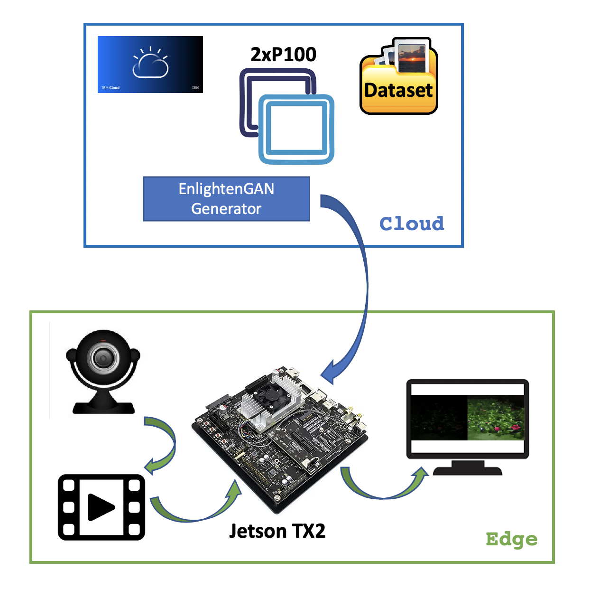  

First, the EnlightenGAN model is trained on IBM Cloud using 2 P100 GPU Ubuntu 16.04 servers with CUDA 11.0.207. The trained model is then downloaded to Jetson TX2 module where it is used to perform frame-by-frame inference on pre-recorded video files.

The following two sections provide detailed description of the Cloud and Edge components.

### **Cloud: Model Training & Evaluation**  

To establish a baseline, we ran the original configuration of EnlightenGAN capturing the loss function on a visdom server. The loss function in GAN considers two distinct contributions - the distribution generated by the GAN and the distribution of the real data as demonstrated by the visdom server's loss over time graph below.

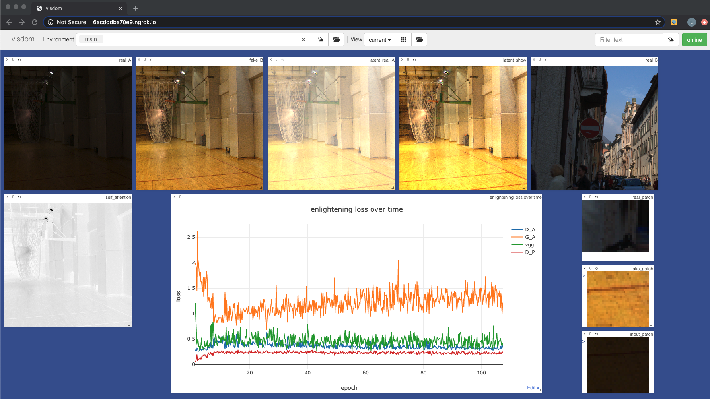

To determine the quality of their model, the authors of the original EnlightenGAN paper rely, instead, on both quantitative and qualitative measures of model performance. We
adopted a similar approach conducting a survey for human subjective evaluation but adopted a different quantitative measures. Where as the author of the original paper uses Natural Image Quality Evaluator score, we use Fréchet Inception Distance. We selected this alternative quantitative as a means to validate or invalidate the author's quantitative findings. FID is computed the Fréchet distance between two Gaussians fitted to feature representations of the Inception network.

For human subjective evaluation we conducted a survey using 10 different images and asking participants to select the best images from nine different generated possibilities. Our findings indicate that human evaluation is suspicious, an unreliable metric, characterized by considerable variation as depicted below.

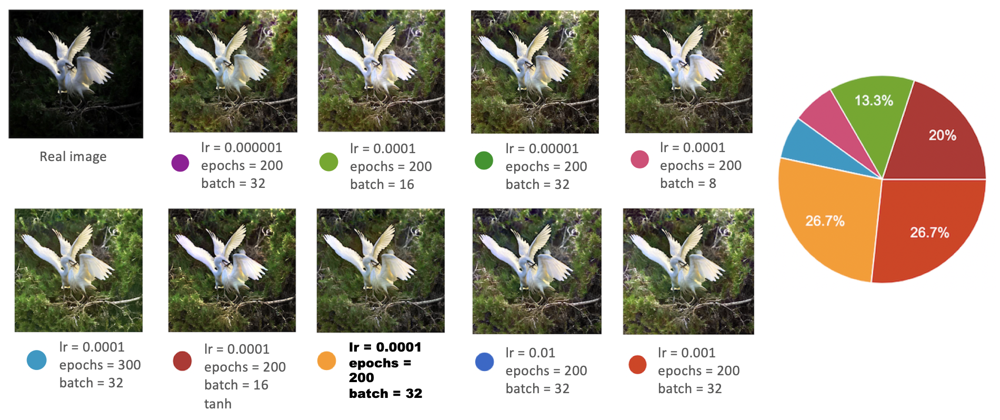
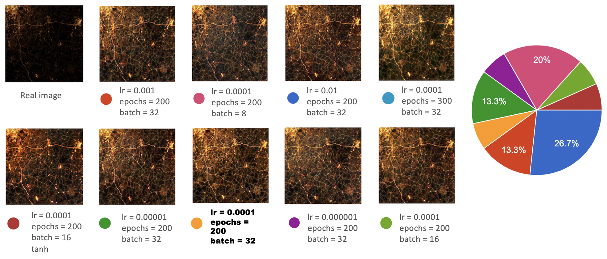
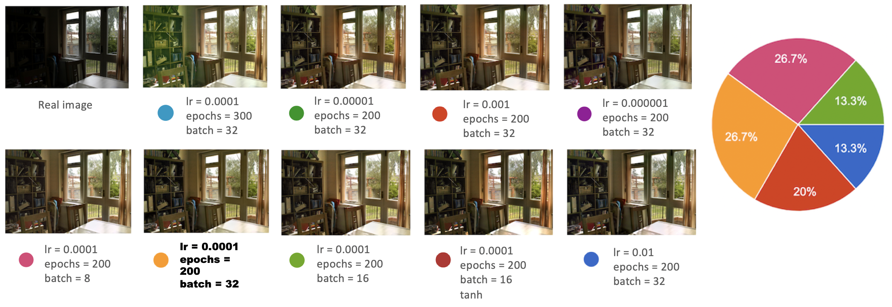
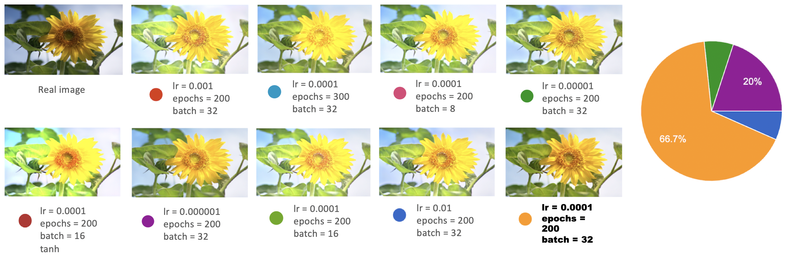
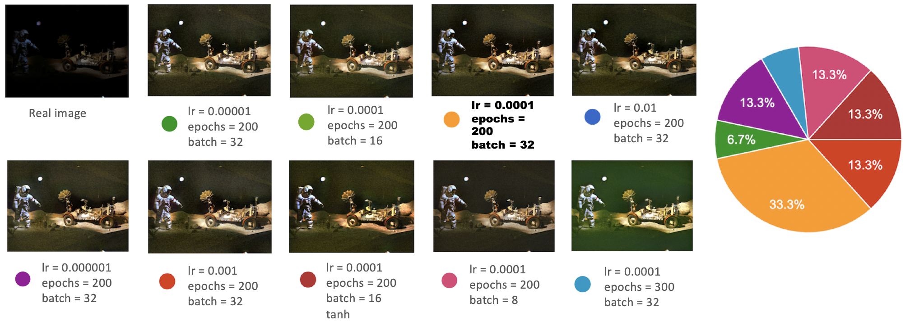
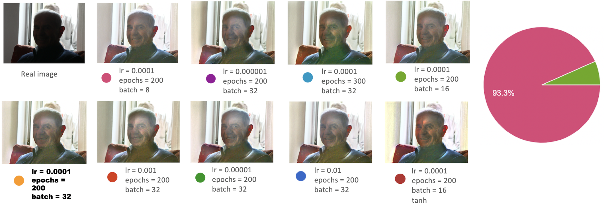
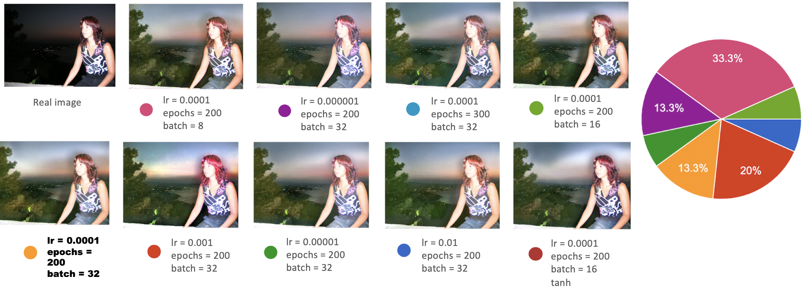
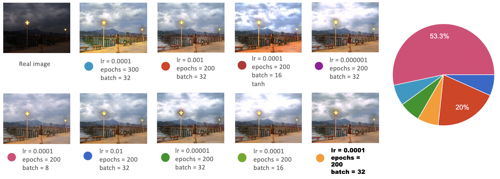
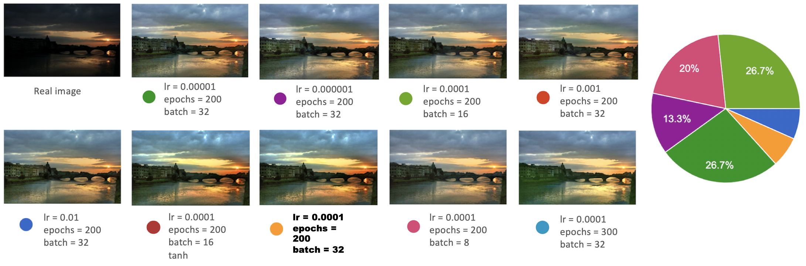
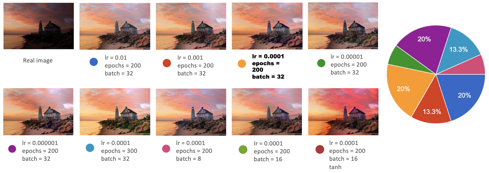

### Hyperparameter Tuning

Our fine tuning focused on learning rates, epochs and batch size. We conducted nine different experiments. Based on FID score alone, our fine tuning indicated that that the baseline selected by the authors yielded the best FID score. Human evaluation suggests that GAN evaluation and FID score are not as well correlated as the proponents of FID score would suggest.

| Hyperparameters                         | FID Score  |
|-----------------------------------------|------------|
| lr = 1e-2  epochs = 200 batch = 32      | 54.364699  |
| lr = 1e-3  epochs = 200 batch = 32      | 54.591752  |
| **lr = 1e-4  epochs = 200 batch = 32**  | **46.975584**  |
| lr = 1e-5  epochs = 200 batch = 32      | 52.309086  |
| lr = 1e-6  epochs = 200 batch = 32      | 48.2036344 |
| lr = 1e-4  epochs = 200 batch = 8       | 47.608967  |
| lr = 1e-4  epochs = 200 batch = 16      | 63.224394  |
| lr = 1e-4  epochs = 200 batch = 16 tanh | 63.224394  |
| lr = 1e-4  epochs = 300 batch = 32      | 54.637000  |

System setup, training/test data, visdom screenshots, training and fine-tuning process, quality evaluation metrics description, quantitative/qualitative scores comparison table for different hyper-parameters.

Training data [[Google Drive]](https://drive.google.com/drive/folders/1bdHoIDW-RTPyFS7OVs2nbfv2Kyh6ZtQX?usp=sharing) (unpaired images collected from multiple datasets)

Testing data [[Google Drive]](https://drive.google.com/drive/folders/1PwpYCmMXode07z5r5z2aNfA_JnwKbuSe?usp=sharing) (including LIME, MEF, NPE, VV, DICP)  

### **Edge: Deployment on Jetson TX2**  

In the original implementation of EnlightenGAN, the inference is performed by running predictions on a batch of images that are copied to a pre-defined folder. The inference results are stored on disk, similarly using a pre-configured location.  

To repurpose the EnlightenGAN model for video processing, we modified the DataLoader ([image_folder.py](/data/image_folder.py), [unaligned_dataset.py](/data/unaligned_dataset.py)) so that it can read frames directly from a video file (.mp4 or .avi) and feed them to the trained model for inference. We also changed the [predict.py](predict.py) script that now runs inference on each frame supplied by the DataLoader and displays both the input and ouput frames side-by-side as a video stream. The new script also supports saving of the two video streams as an .mp4 file.

The detailed description of how to build and run the docker container can be found in [README_Jetson.md](README_Jetson.md), while the animation below demonstrates a sample run of the IllumiGAN application on Jetson TX2:

Here we can see the print-out of the network configuration within the container shell on the left and the data folder containing an input low-light video in the bottom right. The window in the top right corner shows the input and output video streams displayed side-by-side.

We observed that without any optimization the best inference speed we could achieve on low-resolution videos (e.g., 352x288) was about 5 FPS.

To improve the performance, we tried to convert our trained model to TensorRT using NVIDIA's open-source library [Torch2TRT](https://github.com/NVIDIA-AI-IOT/torch2trt), which provides a high-level Python interface for PyTorch-to-TensorRT conversion. Unfortunately, while we were able to convert some state-of-the-art models (i.e., ResNet) to TensorRT successfully, any attempts to apply the library to the EnlightenGAN model resulted in failure. Further details about our experimentation with `torch2trt` converter can be found [here](testtrt).

## Results & Discussion  

To test the performance of our model in terms of the output quality, we ran inference on a set of videos with various degrees of illumination. We used two sources of input data:  

* Royalty-free dataset of [City At Night Stock Video Footage](https://www.videezy.com/free-video/city-at-night)  

* Homemade recordings captured with iPhone 6 and converted to .avi format using a [free online converter](https://www.zamzar.com/convert/mp4-to-avi/).

These recordings were uploaded to Jetson TX2 and used as an input to our IllimiGAN application.  

Below are a few samples demonstrating how the model performed under different lighting conditions.

### **Outdoor (artificial light)**

This video is a representative example of an urban night scene, with both brightly-lit and dark areas present in the field of view. Such scenes are particularly challenging for traditional image enhancement algorithms since they struggle to brighten the dark areas without introducing distortions to the well-lit regions.  

Input &nbsp; &nbsp; &nbsp; &nbsp; &nbsp; &nbsp;&nbsp; &nbsp; &nbsp; &nbsp; &nbsp; &nbsp;&nbsp; &nbsp; &nbsp; &nbsp; &nbsp; &nbsp;&nbsp; &nbsp; &nbsp; &nbsp; &nbsp; &nbsp;&nbsp; &nbsp; &nbsp; &nbsp; &nbsp; &nbsp;&nbsp; &nbsp; &nbsp; &nbsp; &nbsp; &nbsp;&nbsp; &nbsp;Output  
  

As we can see from the side-by-side videos, the input video has a brightly-lit spot at its center while the rest of the objects and the people in front of the building fade into darkness. On the other hand, the video on the right shows as a uniformly-lit scene where colors and details are restored with high fidelity.

### **Outdoor (low-light)**  

The following two samples demonstrate the model's performance under very challenging conditions where the input scene is mostly dark with some occasional bright spots due to artificial lighting.

The first sample is a nighttime scene in Chicago where the only sources of illumination are distant building lights and occasional blinking bike lights from passing bikers.   
While none of the objects or people can be easily detected in the input video (the bikers' presence is only evident by moving shadows), the output video clearly shows the buildings, the fence, the red-and-white construction pole, as well as the two groups of bikers moving in opposite directions. We can even discern the color of their clothes and the shapes of backpacks they're wearing.    

Input &nbsp; &nbsp; &nbsp; &nbsp; &nbsp; &nbsp;&nbsp; &nbsp; &nbsp; &nbsp; &nbsp; &nbsp;&nbsp; &nbsp; &nbsp; &nbsp; &nbsp; &nbsp;&nbsp; &nbsp; &nbsp; &nbsp; &nbsp; &nbsp;&nbsp; &nbsp; &nbsp; &nbsp; &nbsp; &nbsp;&nbsp; &nbsp; &nbsp; &nbsp; &nbsp; &nbsp;&nbsp; &nbsp;Output
  

  
The next video shows our teammate's backyard captured at nighttime. Similar to the Chicago scene above, the original video looks completely dark with some occasional bright spots due to ambient lighting.  
The output video, on the other hand, managed to faithfully recreate the flowers, grass and leaves, as well as the stone structures in the yard. The model sometimes struggles, however, with enhancement of extremely dark areas.  

Input &nbsp; &nbsp; &nbsp; &nbsp; &nbsp; &nbsp;&nbsp; &nbsp; &nbsp; &nbsp; &nbsp; &nbsp;&nbsp; &nbsp; &nbsp; &nbsp; &nbsp; &nbsp;&nbsp; &nbsp; &nbsp; &nbsp; &nbsp; &nbsp;&nbsp; &nbsp; &nbsp; &nbsp; &nbsp; &nbsp;&nbsp; &nbsp; &nbsp; &nbsp; &nbsp; &nbsp;&nbsp; &nbsp;Output  

### **Indoor (low-light)**  
The last example was intended as a stress test to see how well our model can handle the input with no evident external lighting.  
The original video was shot inside our teammate's house during nighttime. It even has a short story line: an intruder is lurking inside the house, looking for a valuable painting, and feeling comfortable since no security camera can detect her presence due to complete darkness. That turned out to be a false hope: our IllumiGAN application was not only able to detect the intruder's presence but was also able to recreate her clothes (and, as a bonus, has revealed the masterpiece painting itself hanging on the wall).  
While the recreated video is very noisy, from the daylight reference image we can infer that the model was able to recontruct the hallway layout along with the content of the painting.   

Input &nbsp; &nbsp; &nbsp; &nbsp; &nbsp; &nbsp;&nbsp; &nbsp; &nbsp; &nbsp; &nbsp; &nbsp;&nbsp; &nbsp; &nbsp; &nbsp; &nbsp; &nbsp;&nbsp; &nbsp; &nbsp; &nbsp; &nbsp; &nbsp;&nbsp; &nbsp; &nbsp; &nbsp; &nbsp; &nbsp;&nbsp; &nbsp; &nbsp; &nbsp; &nbsp; &nbsp;&nbsp; &nbsp;Output&nbsp; &nbsp; &nbsp; &nbsp; &nbsp; &nbsp;&nbsp; &nbsp; &nbsp; &nbsp; &nbsp; &nbsp;&nbsp; &nbsp; &nbsp; &nbsp; &nbsp; &nbsp;&nbsp; &nbsp; &nbsp; &nbsp; &nbsp; &nbsp;&nbsp; &nbsp; &nbsp; &nbsp; &nbsp; &nbsp;&nbsp; &nbsp; &nbsp; &nbsp; &nbsp; &nbsp;Daylight Reference  
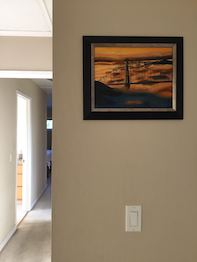

## Conclusion & Future Developments  

**Successes**  
The team was able to successfully validate results from the original EnlightenGAN paper. By experimenting with hyperparameters, and evaluating their output with a quantitative FID score, the team was able to objectively justify the hyperparameters used to train the model. Moreover, the team was successfully able to conduct inference on a recorded video input, generating a side-by-side input and output that successfully shows improved visibility, brightness and contrast.

**Discussion**  
There is a lack of a universal standard quantitative metric for quality evaluation of GAN-generated images (see [[2]](https://arxiv.org/abs/1802.03446v5)). This field is currently undergoing active development as evident form recently published paper ([[3]](https://arxiv.org/abs/2007.12142v1)). In the meantime, many papers use qualitative assessments of the outputs, however as seen by a qualitative assessment on outputs from various versions of the trained model, there is a lot of variation in human judgement in selecting the most "realistic" looking output. While the FID scoring methodology utilized here confirms the hyperparameters used to create the EnlightenGAN authors' pretrained model, further consensus on metric selection in the field is desired.

**Further Research**  
When performing inference on low resolution images, IllumiGAN generates outputs at a rate of about 5 FPS. While the team attempted to use TensorRT to optimize the inference performance, this was utlimately not achievable in the current set up. To enable real-time inference on a streaming input (rather than a recording as demonstrated in this work), successful implementation of TensorRT or equivalent is necessary. We would also be interested in attempting inference on more powerful hardware, such as the NX.    

Furthermore, training could always be further enhanced by additional in-domain training. For example, if IllumiGAN / EnlightenGAN were to be utilized to increase nighttime visibilty for driving, then images specifically from the road would be desirable to improve the model's performance in this application.

## References & Tools

* [1] Yifan Jiang and Xinyu Gong and Ding Liu and Yu Cheng and Chen Fang and Xiaohui Shen and Jianchao Yang and Pan Zhou and Zhangyang Wang. **EnlightenGAN: Deep Light Enhancement without Paired Supervision.** 2019. https://arxiv.org/abs/1906.06972  

* [2] Ali Borji.  **Pros and Cons of GAN Evaluation Measures.** 2018. https://arxiv.org/abs/1802.03446v5   

* [3] Jinjin Gu, Haoming Cai, Haoyu Chen, Xiaoxing Ye, Jimmy S. Ren, and Chao Dong. **PIPAL: a Large-Scale Image Quality Assessment Dataset for Perceptual Image Restoration.** 2020. https://arxiv.org/abs/2007.12142v1

* **Video Converter**: https://www.onlineconverter.com  

* **Visdom**: A flexible tool for creating, organizing, and sharing visualizations of live, rich data. https://github.com/facebookresearch/visdom

* **NVIDIA PyTorch to TensorRT Converter**: https://github.com/NVIDIA-AI-IOT/torch2trt

## Link to Slide Presentation
[Link to Google Slides](https://docs.google.com/presentation/d/12oYou94CZlgLH9lBoLocZ74WaNtK_ns3_fRwtMdV4nU/edit?usp=sharing)
