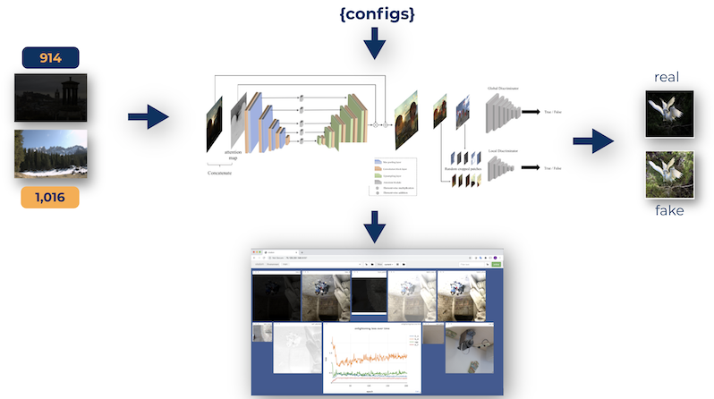

# Model training and inference in IBM Cloud

Diagram below depicts the setup and the flow of the model and inference process for the application.



The model was trained on 2 VMs of x P100 GPUs for redundancy purpose so two different trainings could be performed concurrently.

## Environment prerequisite(s)

Items below are required to run the application.

- python>=3.6.x
- pip
- torch>=1.5.1
- torchvision
- visdom
- dominate

Install python and pip as the initial step followed by executing below commands.

```
cd <project_root>/w251 project

pip install -r requirement.txt
```

## Dataset preparation

## Model trainings

## Model validation

## Hyperparameters Tuning

## Fréchet Inception Distance (FID) implementation
