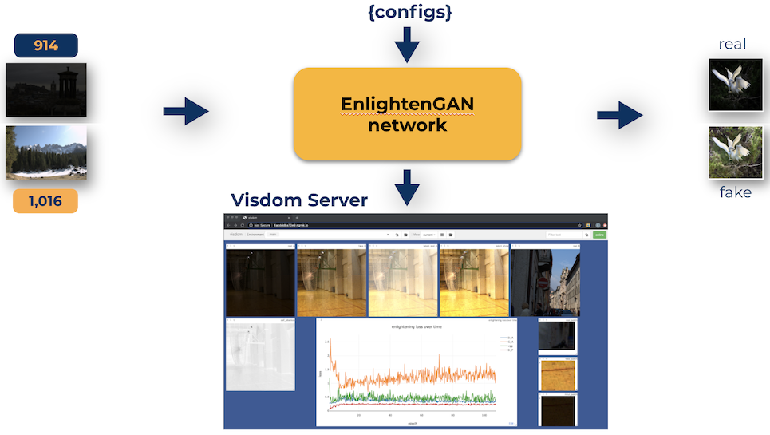

# Model train and validation in IBM Cloud

Diagram below depicts the setup and the flow of the model and inference process for the application.



The model was trained on 2 Ubuntu 16.04 VMs with 2 x P100 GPUs and CUDA 11.0.207 for redundancy purpose so that two different trainings could be performed concurrently and independently.

## Environment prerequisite(s)

Items below are required to run the application.

- [python>=3.6.x](https://www.python.org/downloads/)
- [pip3](https://pip.pypa.io/en/stable/installing/)
- torch>=1.5.1
- torchvision
- visdom
- dominate

Install python and pip as the initial steps followed by executing below commands.
> Note: <br>If `w251_project` folder is renamed after being cloned then use that new folder name accordingly to all the steps below.

```
cd <project_root>/w251_project

pip install -r requirement.txt
```

## Dataset and environment preparation

IllumiGAN uses similar train and test dataset as the based EnlightenGAN network.

1. Create a `final_dataset`, `test_dataset`, `model` and `checkpoints` folder.

```
mkdir -p <project_root>/final_dataset

mkdir -p <project_root>/test_dataset

mkdir -p <project_root>/w251_project/model

mkdir -p <project_root>/w251_project/checkpoints/enlightening
```

2. Download the train data from [here](https://drive.google.com/drive/folders/1bdHoIDW-RTPyFS7OVs2nbfv2Kyh6ZtQX?usp=sharing). It contains two folders `trainA` and `trainB` and copy both of the folders to `final_dataset` folder.
> Note: <br>Extract `trainA` and `trainB` respectively if they are in compressed format.

3. Download the test data from [here](https://drive.google.com/drive/folders/1PwpYCmMXode07z5r5z2aNfA_JnwKbuSe?usp=sharing). It contains two folders `testA` and `testB` and copy both of the folders to `test_dataset` folder.
> Note: <br>Extract `testA` and `testB` respectively if they are in compressed format.

4. Download the [vgg pre-trained model](https://drive.google.com/file/d/1AkV-n2MdyfuZTFvcon8Z4leyVb0i7x63/view?usp=sharing) and copy that to the `model` library.
> Note: <br>Extract the pre-trained model if it is in compressed format.

## Model train

1. Launch [visdom](https://github.com/facebookresearch/visdom) server to visualize training loss and open browser with local or public IP address of this application where it is running with port `8097` (e.g. `http://<IP_address>:8097/`).

```
./visdom > /dev/null 2>&1 &
```

2. Start the train process.

```
nohup python3 scripts/script.py --train &
```

## Model validation

1. The trained model will be saved on `<project_root>/w251_project/checkpoints/enlightening`. Alternatively, download the [illuminGAN pre-trained model](https://drive.google.com/drive/folders/1MeHOhhT0O2NDz6YL5nSn-elK-Oih2Oso?usp=sharing) and copy that to `checkpoints/enlightening` folder.
> Note: <br>Extract the pre-trained model if it is in compressed format.

2. Start the validation process

```
python3 scripts/script.py --predict
```

3. Validation process will yield synthesized images from actual images in `<project_root>/w251_project/ablation/` folder.

## Hyperparameters Tuning

1. IllumiGAN provides a set of configurations for hyperparameters at following locations.

- `<project_root>/w251_project/scripts/script.py`
- `<project_root>/w251_project/options/base_options.py`
- `<project_root>/w251_project/options/train_options.py`
- `<project_root>/w251_project/options/test_options.py`

2. All the hyperparameters tuning should be done at `script.py` by adding respective parameters that are desired to fine-tune referring to `train_options.py`, `test_options.py` and `base_options.py`.

3. Re-run the train process.

## Fréchet Inception Distance (FID) implementation

FID is used to measure the quality of the synthesized images from the actual images quantitatively. The synthesized and actual images need to be separated in prior from the validation output folder.

1. Go to `pytorch-fid` folder.

```
cd <project_root>/pytorch-fid
```

2. Split the synthesized and actual images to preferred folder.

```
chmod +x split_real_fake.sh
./split_real_fake.sh -f ../w251_project/ablation -t fid_split
```
> Note: <br>`chmod` is ran when `split_real_fake.sh` is not executable.
<br>argument -f: 'from' folder where ablation is located.
<br>&emsp;&emsp;&emsp;&emsp;-t: 'to' folder where split folder is desired.

3. Run the `fid-score` to compute the FID score.

```
chmod +x fid_score.py
./fid_score.py fid_split/real/ fid_split/fake/
```

> Note: <br>`chmod` is ran when `split_real_fake.sh` is not executable.
